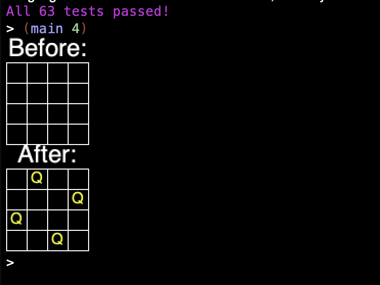
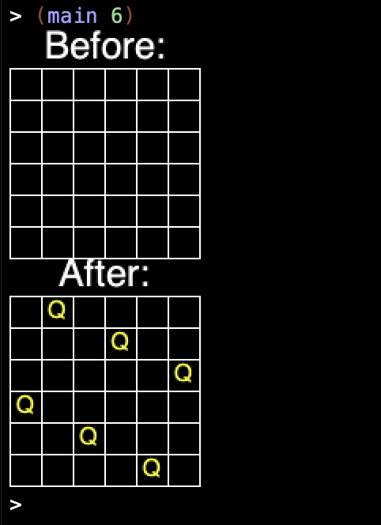
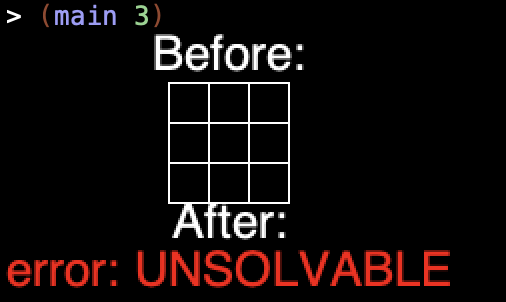

# nqueens-visualizer

### Visualization of NQueens solver using backtracking search.  

**Demonstration:** 
Solving a 4x4 chess board  
      
Solving a 6x6 chess board  
      
Error when prompted to solve for an unsolvable 3x3 chess board  

